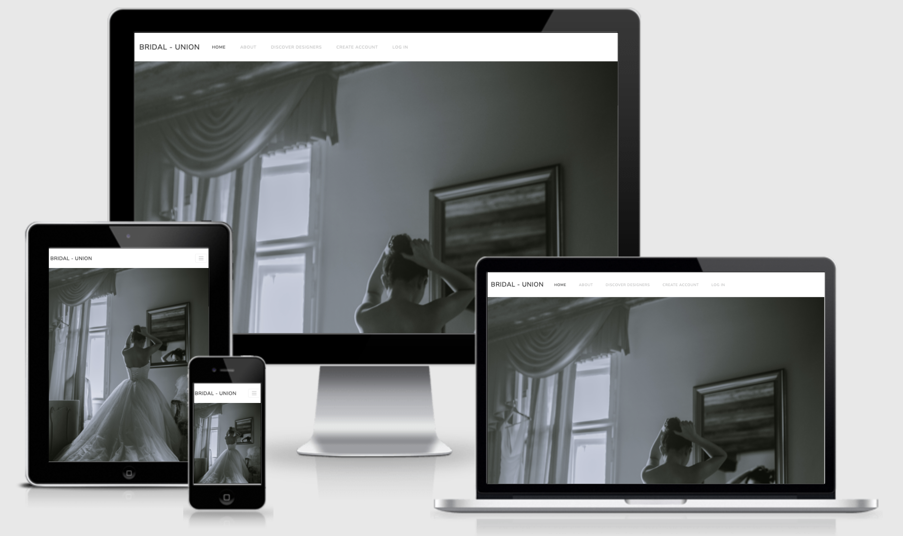

# Bridal Union

The live site can be found here (link)

This is a full-stack framework project built using Django, Python, HTML, CSS, BootStrap and JavaScript. This is a social media inspired application designed to connect freelance wedding dress designers with future brides-to-be. The user can explore a range of designers, like and comment on images posted by a designer, as well as create, edit and delete bookings with their designer of choice. 

This project has been built on GitHub workspaces and deployed on Heroku. This project was built for educational purposes. 

## UX

Birdal-Union (BU) was built with two main intentions; to promote and to connect. With this in mind and following UX core principles, the UX had to be easy to navigate, intentional and pleasurable for the user, all whist encouraging user action. 

The first steps for structuring the UX were to outline the user’s needs collectively. For BU there are two main users; the designer (admin user) and the bride-to-be (end user). Both of which can full-fill each other’s needs; the bride needs a dress and the designer needs business, therefore the focus is to get both users to connect. To target this, the UX is based on social media platforms (such as Instagram) where the end user can connect with the designer through familiar features such as ‘follow’, ‘like’ and ‘comment’. 

When thinking of the user needs separately: for a future bride, wedding dress hunting can often be time-consuming and overwhelming, therefore the UX intends to take that away by offering something that is clean, focused as well as intuitive. We can also assume that this user will most likely be using their mobile phones more frequently than desktops screens (especially as a busy bride planning her wedding, most of the time looking for dresses are done on the commute to work). Therefore, responsivity and navigation are integral to the design and flow of the site. I have used the Bootstrap grid system, a selection of <a href="https://getbootstrap.com/" target="_blank">Bootstrap elements</a>, <a href="https://bootswatch.com/lux/" target="_blank">Bootswatch Lux</a> theme elements and custom CSS to allow for this. 

For the designer, promoting their work can also be challenging and time-consuming, to target this, the UX intends to promote their work in an elegant, interactive and efficient way. With this in mind, the focal point throughout the site are the images posted by the designers, therefore the UX was designed to act as a canvas to host these images in a responsive and eye catching way. To allow for this, I have used a Bootswatch Lux theme as the main theme for the site, <a href="https://getbootstrap.com/docs/4.0/examples/album/" target="_blank">Bootstrap album </a> elements as well as custom CSS.

------

## USERS

As outlined previously, there are two main users for Bridal-Union are:

**User 1** - A freelance wedding dress designer who is looking to promote their work, get client bookings and sell their services whilst expanding their clientele. 

**User 2** - A future bride-to-be who is looking for a wedding dress designer to make their dream dress for their big day. 

**User stories:**

Below are user story scenarios and how Bridal-Union intends to meet those needs.

**As a wedding dress designer (admin user):**

I can easily post any images of my work via the admin panel so that I can share and promote my work  to a wider audience.

I can log in to the admin panel so that I can access the site’s backend.

I can easily log out of the admin panel as needed.

Using the admin panel I can add important information to my profile such as location, starting price and biography so the user can easily view this information. 

I can update my profile information via the admin panel to ensure my profile is always up-to-date.

I can use the admin panel to delete images I no longer wish to have displayed on site. 

When uploading my images, I can add a description to provide context for the user via the admin panel. 

I don’t have to worry about resizing any images prior to upload as the admin panel takes care of that for me.

I can add hashtags to my images to help target my intended audience and help follow trends.

In the admin panel, I can reply back to comments left on my posts so I can interact and engage with the end user. 

I can delete customer reviews if they are deemed bad via the admin panel. 

I can confirm / decline customer booking if needed via the admin panel and the user will be notified of any changes.

**As a bride-to-be (end user):**

I easily can browse through the app to get inspiration for my wedding dress by viewing posts/images from different designers. 

I can view all images posted by a single designer by visiting their portfolio page. 

Using the navigation bar and links throughout the site, I can navigate easily throughout the different pages to view the desired content.

I can view a designer’s profile to find out more information about their services and work by visiting their profile page.  

I can easily interact with the designer by liking and commenting on their posts.

I can connect with the designer by following them via the follow feature so I can keep up to date with them.

I can easily book an appointment with my designer of choice using the booking form. 

I can easily create a customer account where I can manage and view my existing bookings. 

I can log into my account to cancel and/or reschedule a booking if needed.

If the designer has cancelled or rescheduled my booking, I will be notified.

I can log into my account to update and edit my account information so that it is always up to date.

I can easily log in and log out of my account as needed.

I have the options to delete my account if I no longer need it.

------

## SCOPE

In order to achieve the desired user’s needs and business goals, the following features have been considered. However, kindly note that the full scope has not been met due to time constraints, please visit ‘Features left to implement’ below to see the features which have not been included in this current version of Bridal Studios. 

- Responsive navigation that will link to various pages throughout the site, collapse when viewed on specific screen sizes to allow for seam free navigation across all screen sizes.

- Landing page with hero image, tag line, short introduction and links to intuitively take the user to different parts of the website. 

- Discover Designers page where the user can scroll through the page to view, ‘follow’, ‘like’ and ‘comment’ on images posted by different designers. 

- Designer profile page where the user can read more information about a designer such as number of followers, biography, location and starting price.

- Portfolio page where the user can view all of the images posted by one designer in a single location. 

- Booking page where the user can make an appointment with their designer of choice via the booking form 

- About page to provide further information to the end user about the website and how it can help them. 

- Sign up, Log in and Log out features using Django allauth 

- Customer Account page where logged in users can edit/delete existing bookings and manage their customer account details 

- Email notifications to inform the customer when their booking has been confirmed, canceled or rescheduled by the designers. 

- Javascript and CSS animation features to enhance the overall UX.

---

## STRUCTURE / BACK END 

**App structure:**

For this current release, Birdal-Union is made up of two main apps:

social_marketplace - main functionality 

Djngo alltuh - registration and account management

**Database:**

It was advised to use cloud based databases given Heroku’s ephemeral file system, so the below have been used for this project:

For data storage - <a href="https://www.heroku.com/postgres" target="_blank">Heroku’s add-on PostgreSQL</a>

For image storage - <a href="https://cloudinary.com/" target="_blank">Cloudinary</a>

**Django Models:**

To achieve the current functionality, the social_marketplace app requires 4 main custom models and the Django built in User model:

**Django User model:**

I used <a href="https://docs.djangoproject.com/en/4.0/ref/contrib/auth/" target="_blank">Django’s built in User model</a> as is to handle all the user information. 

**Designer model:**

Contains information about the designer such as name, location, starting price and biography. This information is needed to build out the designer profile page. Each designer uses Django’s pre assigned id’s and this is used to target the designer to render the relative designer information on the designer profile page. There is also a date joined field provided which is not currently displayed on site, its intention is more for potential future administrative use. 

**Imageposts model:**

This model contains image information, number of likes and handles image upload and resizing. For the front end, each image that is posted displays the name of designer, date posted, number of likes, image description and hashtags for the end user’s information. For backend admin users, this models enables the admin to handle the status of the post by selecting either ‘draft’ or ‘posted’. The admin can also add or delete as many images as they desire. 

This model has a Foreign Key relationship to the Designer model so that an image can be access by the designer it was posted by (as well as its image id (again, default by Django)).

**ImageComments model:**

This models is to display and handle comments left by the end user on posts. Comments are subject to approval by the admin user and can be rejected if deemed bad. This model has a Foreign key relationship with ImagePosts in the ‘post’ field to ensure all respective comments are deleted in the event of an image post being deleted.

**Booking model:**

This model displays and handles the booking information needed for the booking form. A booking can only between one end user and one designer at a time, as a result this model has a One to One relationship with the Django built in User model and a Foreign Key relationship with the Designer Model, as well as a unique booking ref. Bookings are also subject to approval by the admin user which they can manage on the back end.

## STRUCTURE / FRONT END 

I wanted to keep the design clean, minimal and modern to allow emphasis and focus on the imagery posted by the designers.  As mentioned previously, the main theme for this site is provided by <a href="https://bootswatch.com/lux/" target="_blank">Bootswatch Lux</a> theme which allows to do just that. 

**Fonts:**

Header tags: Nunito Sans provided by Bootswatch Lux theme 

Paragraph tags:  Raleway from Font Awesome 

---

---

---

---

