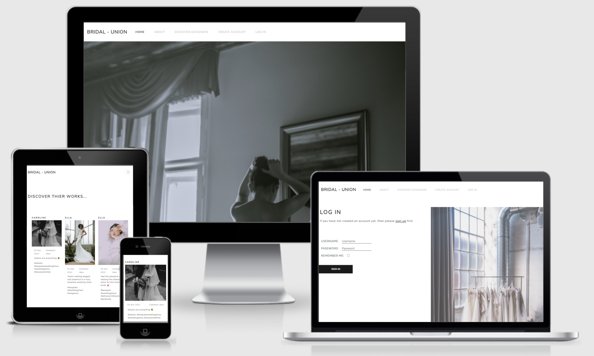
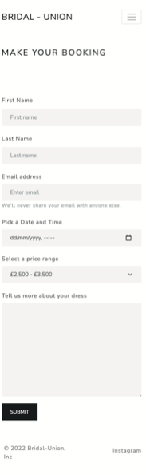
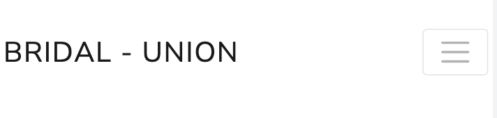
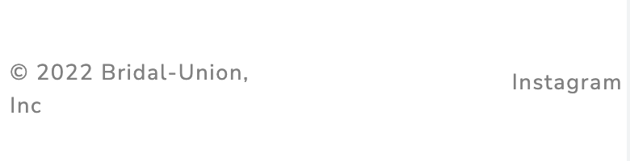
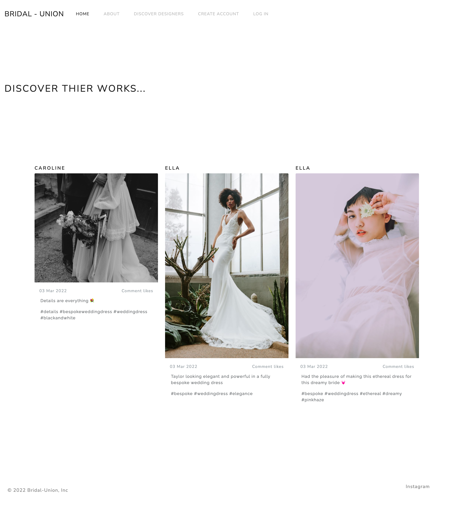
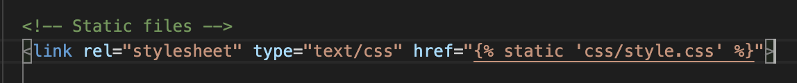
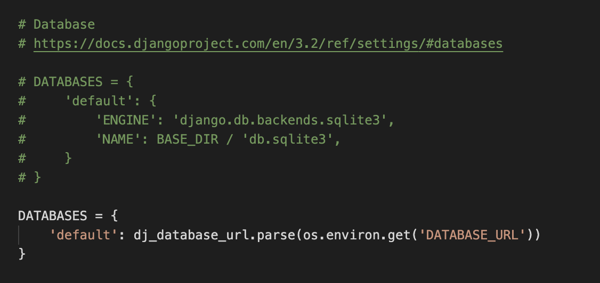
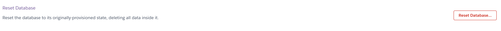

# BRIDAL-UNION

This is a full-stack framework project built using Django, Python, HTML, CSS, BootStrap and JavaScript. This is a social media inspired application designed to connect freelance wedding dress designers with future brides-to-be. The user can explore a range of designers, like and comment on images posted by a designer, as well as create, edit and delete bookings with their designer of choice. 

This project has been built on GitHub workspaces and deployed on Heroku. This project was built for educational purposes. 

The live site can be found <a href="https://bridal-union.herokuapp.com/" target="_blank">here</a>

## UX

Birdal-Union (BU) was built with two main intentions; to promote and to connect. With this in mind and following UX core principles, the UX had to be easy to navigate, intentional and pleasurable for the user, all whist encouraging user action. 

The first steps for structuring the UX were to outline the user’s needs collectively. For BU there are two main users; the designer (admin user) and the bride-to-be (site user). Both of which can full-fill each other’s needs; the bride needs a dress and the designer needs business, therefore the focus is to get both users to connect. To target this, the UX is based on social media platforms (such as Instagram) where the end user can connect with the designer through familiar features such as ‘follow’, ‘like’ and ‘comment’, as well as the abiltiy to book a designer.

When thinking of the user needs separately: for a future bride, wedding dress hunting can often be time-consuming and overwhelming, therefore the UX intends to take that away by offering something that is clean, focused as well as intuitive. We can also assume that this user will most likely be using their mobile phones more frequently than desktops screens (especially as a busy bride planning her wedding, most of the time looking for dresses are done on the commute to work). Therefore, responsivity and navigation are integral to the design and flow of the site. I have used the Bootstrap grid system, a selection of <a href="https://getbootstrap.com/" target="_blank">Bootstrap elements</a>, <a href="https://bootswatch.com/lux/" target="_blank">Bootswatch Lux</a> theme elements and custom CSS to allow for this. 

For the designer, promoting their work can also be challenging and time-consuming, to target this, the UX intends to promote their work in a modern, interactive and efficient way. With this in mind, the focal point throughout the site are the images posted by the designers, therefore the responsiveness of the images is very important. To allow for this I have used Bootstrap elements, Bootstrap Album example together with custom CSS so that the images can be viewed seamlessly across different screen sizes without visualising impairing them and allowing for better UX. In addition, the UX has to enables the user to intuitively navigate through out the site to view the relevant designer information with less clicks, to target this I have used call to action buttons in convenient places as well as a responsive nav bar. 

------

## USERS

As outlined previously, there are two main users for Bridal-Union:

**User 1 (admin user)** - A freelance wedding dress designer who is looking to promote their work, get client bookings and sell their services whilst expanding their clientele. 

**User 2 (site user)** - A future bride-to-be who is looking for a wedding dress designer to make their dream dress for their big day. 

**User stories:**

Please find all my defined user stories and their acceptance criteria in the probject board [here](https://github.com/Esteph27/Bridal-Union/projects/1)

- As an Admin User I can update a Designer's profile information to ensure my profile is always up-to-date.

- As a Site User, I can add a new designer or delete an existing designer to manage the designers being promoted on the site.

- As an Admin User I can create draft posts so that I can finish writing the content later.

- As a Site User I can manage my existing bookings so that this information is always up to date.

- As a Site User I can easily see if I'm logged in or not so that I can choose to log in or log out depending on what I'm doing.

- As a Site User I can register an account so that I can comment and like on posts, make a booking with a designer and manage my existing bookings.

- A Site User can create an account via the allauth registration forms.

- A new Site User will be assigned a profile page where they can view their existing bookings.

- As a Site User I easily can browse through the app to get inspiration for my wedding dress by viewing posts/images from different designers.

- As a Site User I can find relevant contact information easily.

- As a Site User I can easily and intuitively navigate my way through the site to find the relevant information I'm looking for with little amount of clicks.

- As a Site User I can use the navigation bar to easily navigate throughout the different pages to view the desired content.

- As an Admin user I can approve or disapprove comments so that I can filter out objectionable comments.

- As an Admin User, I don’t have to worry about resizing any images prior to upload as the admin panel takes care of that for me.

- As an Admin Uyser I can confirm or decline bookings to help me manage the designer's booking efficiently.

- As a Site User I can easily interact with the designer by liking and commenting on their posts so that I can form a connection with the designer.

- As a Site User can I comment on a post when logged in.

- As a Site User I receive notifications to confirm actions taken on the site.

- As a Site User I can click on a post so that I can view all comments.

- As a Site User, I can view a designer's information to get information about a specific designer. I can find out who they are and how they work in order to help me decide if they are the designer to make my wedding dress or not.

- As a Site User / Admin I can view comments on an individual post so that I can read the conversation.

- As a Site User I can easily see if I'm logged in or not so that I can choose to log in or log out depending on what I'm doing.

- As a Site User I can like or unlike a post so that I can interact with the content.

- As a Site User / Admin User I can view the number of likes on each post so that I can see which is the most popular or viral.

------

## SCOPE

When planning the initial design for this project, I had to outline which features were absolutely essential to include in this current release, and other features that would become part of the scalability plan to include in future releases. The following features have been considered for this current release:

Version 1;
- Responsive navigation that will link to various pages throughout the site, collapse when viewed on specific screen sizes to allow for seam free navigation across all screen sizes.

- Landing page with hero image, tag line, short introduction and links to intuitively take the user to different parts of the website. 

- Discover Designers page where the user can scroll through the page to view, ‘like’ and ‘comment’ on images posted by different designers. 

- 'Follow' features were a logged in user can 'follow' a deisgner (like a person would 'follow' someone on Istagram).

- Designer profile page where the user can read more information about a designer such as number of followers, biography, location and starting price.

- Portfolio page where the user can view all of the images posted by one designer in a single location. 

- Booking page where the user can make an appointment with their designer of choice via the booking form 

- About page to provide further information to the end user about the website and how it can help them. 

- Sign up, Log in and Log out features using Django allauth 

- Customer Account page where logged in users can edit/delete existing bookings and manage their customer account details 

- Email notifications to inform the customer when their booking has been confirmed, canceled or rescheduled by the designers.

- Review section where a user can view and post reviews on designers

- Javascript and CSS animation features to enhance the overall UX.

For future release, please see the Scaleability section below outlining the features Bridal would hope to include.

---

## STRUCTURE / BACK END 

**App structure:**

For this current release, Birdal-Union is made up of two main apps:

- social_marketplace - core functionality including social media actions

- Bookings - booking functionlaity and managment, display customer account

**Database:**

It was advised to use cloud based databases given Heroku’s ephemeral file system, so the below have been used for this project:

- For data storage - <a href="https://www.heroku.com/postgres" target="_blank">Heroku’s add-on PostgreSQL</a>

- For image storage - <a href="https://cloudinary.com/" target="_blank">Cloudinary</a>

**Django Models:**

I have created Entity Relation Diagrams to illustrate the database models and the relationships to each other.

You can view them [here](https://drawsql.app/esteph/diagrams/bridal-union)

### To achieve the current functionality, the social_marketplace app requires 3 main models:

**Designer model:**

Contains information about the designer such as name, location, starting price and biography. This information is needed to build out the designer profile page. Each designer uses Django’s pre assigned id’s and this is used to target the designer to render the relative designer information on the designer profile page. There is also a date joined field provided which is not currently displayed on site, its intention is more for potential future administrative use. 

**ImagePosts model:**

This model contains and handles posts made by the admin user. It handels and displays number of likes a post has recieved as well as image upload and resizing images. This information is used to build the discover designers page where each 'post' made by the admin is featured on this page with key information such as date posted, hashtags and likes. For backend admin users, this models enables the admin to handle the status of the post by selecting either ‘draft’ or ‘posted’, as well as delete enabling the admin to manage their content easily. It also handels image resizing through Cloudinary's URL transformation so the admin can upload instantly without having to rescale or crop their images in any particular way.

This model has a Foreign Key relationship to the Designer model so that an image can be access by the designer it was posted by (as well as its image id (again, default id by Django)).

**ImageComments model:**

This models is to handle and display user and admin comments made for a specific post. This model has a Foreign Key relationship  with the ImagePost model so that it can specify the the post the comment is being left on and can be accessed via the front end. It also has another FK relatitionship with the Django built in user model so that a comment can be made only by logged in users. Comments are also subject to approval by the admin user and can be rejected if deemed bad, this is done by the boolean feield in the 'approved' field. 

This model has a built in method to arranage the comments in desencindg order via date posted, this is so that the comments to appear in order starting with the most recent date at the top.

### To achieve the current functionality, the bookings app requires 2 models:

**CustomerProfile model:**

I extended <a href="https://docs.djangoproject.com/en/4.0/ref/contrib/auth/" target="_blank">Django’s built in User model</a> to create user profiles for each logged in user so that a user can view their booking information via the front end. 

**Booking model:**

This model handles and displays bookings made the site user, as well as contain the information needed for the booking form.

A single booking can only be made between one site user and one admin/designer at a time, as a result this model has a FK relationship with the CustomerProfile model and a FK relationship with the Designer Model, as well as a unique booking ref in order to help identify individual bookings. Bookings are also subject to approval by the admin user, this is managed by the booking status field where the admin user can select a status of 'confirm booking' or 'decline booking'.

Using the related name between the CustomerProfile, a user's booking can be displayed on the front end. It's also used to pre popukate the edit booking form with the relative booking inforamtion.

The site user is given the option to select a time and date for their appointment with the deisgner, however due to time contraints this model does not handle checking time and date availabilities, or site user erros such as selecting a date that's in the past.  

## STRUCTURE / FRONT END 

I wanted to keep the design clean, minimal and modern to allow emphasis and focus on the imagery posted by the designers. The main design theme for this site is provided by <a href="https://bootswatch.com/lux/" target="_blank">Bootswatch Lux</a> theme which allows to do just that. 

**Fonts:**

Header tags: Nunito Sans provided theme <a href="https://bootswatch.com/lux/" target="_blank">Bootswatch Lux theme</a> 

Paragraph tags:  Raleway from <a href="https://fonts.google.com/" target="_blank">Google Fonts</a>

**Color:**

Again, minimalistic a main design component throughout Bridal-Union, in oder to give emphasis to the images. Therefore the colour scheme is kept neutral and simple with Black, White and Grey as the core color palette.

**black #00000:** this colour has been used for solid and sharp shapes such as button background and footer background colour in order to adhere to the modern and clean element of designer. It's also used for the nav bar links for when the user hovers over the links so that they're highlighted for the user imporving UX and accessbility. 

**grey #55595C:** this colour is the main text colour. Initially the text was going to be black but found it was to harsh against, so I then switch to this grey colour which adds a softer touch to the overal design.

**white #fffff:** this is the main background colour. As the main emphasis is on the post and designer profile, I wanted a neutral background to act as a canvas so I stuck to the regular white. This white is bright and modern which compliments the design theme. 

**Responsiveness:**

To allow for seam free navigation between the pages and for the images to adjust proportionately on various screen devices, I’ve used a mix of Bootstrap classes and image elements, Bootswatch buttons, cards and navigation bar to enable this.

I’ve also used custom CSS and media queries to allow for this. 

**Visual effects:**

The previous plan when designing the front end was to include gentle animation and visual effects to compliment certain features as well as provide more visual pleasure for the user. However, due to time constraints, there is only one zoom animation feature (hero image on the landing page) in this current version. 

**Wireframes:**

The wireframes were used as a guide for the UX and front-end design, as a result the website differs from the wireframes, however the flow and logic are representative in the live site. The design features in the wireframes were also created before finding Bootswatch Lux theme, therefore some features in the wireframes are not included in this version. 

You can view the wireframes <a href="https://www.figma.com/file/kvbIiuHdZFGnj4ih7hIqC6/Bridal-Union-Wireframes" target="_blank">here</a>

---

## FEATURES:

**Home page:**

When the user opens the app, this is the first page they will see therefore I used a strong hero image to capture the attention of the user. A zoom effect has also been applied to the hero image to visually excite the user.

This page has been kept simple in terms of design as it’s more of an introductory page to the app, to help with this there are three main sections; the first one is a short introduction as to what the user can expect to find. This is underneath the hero image so that the user can instantly understand what this webstie is about. There is also a call-to-action button inviting the user to view the 'discover designers' page which is one of the main pages of the site:

The second part addresses logged out and unreguistered users. For logged in users, having the login link in the homepage is convienent which is good for UX. Whilst for unregistered users, they are encouraged to create an account by displaying the create account link. This is also good for the business as their goal would to get an amuy users to sign up as possible:

The third part is a button to take the user to the About page so that users can quickly find more information about the website:

**About page:**

The aim of this page is to provide further and useful informaiton to the user about Bridal Union. It contains information about who they are, who and how they work with so that the user can get a better understanding of the website and it's intentions. 

This page also features a hero image with a zoom aniation feature (the same as the hero image in the landing page) to create visual impact and a nicer UX.

Another goal for the abou page is to encourage new users to sign up, to achive this encouraing text, a call to action button and image to visually entice the user:

**Discover Designers page:**

As mentioned above, this is one of the main pages of the app. This page is where the social media inspired elements comes to play where the user can scroll through to view posts by different designers (like they would if they were on Instagram). The image posts includes the name of the designer so they user can see who it was posted by, the date posted, hashtags, view the number of ‘likes’ and 'comments' a post has recieved so they can see which one has been more popular. All users can view the number of likes and comments, however only logged in users are able to like and post a comment on a post (more about this below)

The like feature is represented by a heart icon and has the number of likes next to it. If the user 'likes' an image they can click on the heart icon and number count will increase by one. If the user decides to unlike the image they can click on the heart icon again and number count will decrease by one.

This page also displays a small description underneath the page title so that first time users can better understand how to use this page:

**Image Post Detail page:**

This page displays all comments a particular post has reiceved. The user can access this page by clicking on the 'view all messages' link at the bottom of the image post:

The aim for this page is to encourage users to connect with the designer by commeting on their post and by joining in a conversation, similar to a blog post. For logged in users, the comment form appears at the bottom of the comment list so that it's easy to find. The comment form also tells the user that they are posting by their username. Once the user has submitted their comment, a message will display on screen notyfing the user that their comment will be waiting approval. An alert message will also appear at the top of the screen to notify that their message has been recived:

For users who are not logged in or unregistered the comment form is unavaible, instead appears a call-to-action button to prompt the user to create an account in order to 'join the conversation':

The comment themselves consist of the user name to show who the comment was posted by, the date it was posted and the comment itself. The comments are also ordered in descending order so that the most recent comment is at the top:

The like feature is also available in this page, however it's a little bit more visual for the user. If the user clicks on the heart icon, the number count will increase by one as well as the heart will turn into a sold heart. If the user decides to unlike the post then the heart icon will revert back to an outline and the number count will decrease by one. 

**Designer Profile page:**

Together with the ‘discover designer’ page, this is another main page where the user can find out more information about the designer. This page displays the designer’s biography so the user can find out more the designer and their way of working, their location to see if the designer is local to them and starting price so the user can see if their prices are suitable for them.

All of the information mentioned is to help the user feel like they can make an informed decision as to booking this designer. To encourage this action, the booking button has been placed under the designer name aking it convenient and easy for the user to click on. However this booking button is only aviable for logged in users:

If the user is not logged in or registered, intead of this button is a message to inform the user that they will need to create an account or log in if they would like to proceed with the booking:

Another main feature of this page is the designer post. At the top of the page are all the posts which a deisgner has posted, this is so that the user can view a specific designer's post all in one location. This section acts like a sort of portfolio where the user can see all the work a designer has done to help the user decide if this designer is the one to book:

**Booking page:**

This page is where the user can make a booking with their designer of choice using a simple booking form. The booking form will take in important information such as the users name, designer’s name, date of the user's wedding, and the user will be able to select a date and time aviable. The user will also be able to select a price bracket to indicate to the designer how much they are willing to spend on their wedding dress. The form also has a 'customer message' box where the user can include more information about their dress and ideas. 

To make a booking a user will have to be logged in.

**Create Account page:**

A user can create an account easily and quickly if they haven’t already done so. A user will need to create an account if they wish to make bookings and access other features of the site. 

The functionality and validations of this template are from Django alltuh with applied custom CSS, Bootstrap and Bootswatch elements for styling.

**Log in and Log out page:**

To access all features such as making a booking, ‘like’ and ‘commenting’ in images and ‘following’ a designer, the user will have to be logged in. A logged in user can also sign out easily.

The functionality and validations of these pages are from Django alltuh with applied custom CSS, Bootstrap and Bootswatch elements for styling.

**Customer Account page:**

This page is where the user can manage all of their booking and account information. Here the user can view any existing bookings they have made. The bookings are currently displayed on card which are provided by Bootswatch Lux theme. The booking cards show the name of the designer, the time and date of their booking. The booking cards also show ‘cancel’ and ‘edit’ links to allow the user to manage their booking as needed. The user also has the option to update their account details, delete their account or log out from their account. 

Please note that due to time constraints, this page is currently static and is not yet connected to the back end to access functionality. 

**Navigation bar:**

The Navbar is provided Bootswatch Lux theme. Its design is minimal and modern and it provides smooth and easy navigation for the user from page to page and across various screen sizes. 

On desktop screen the nav bar displays across the width of the top of the screen and all of the links in the nav bar are displayed evenly across the screen allowing the user to see each link clearly. The name of the app ‘Bridal Union’ is also displayed clearly in the left side of the nav bar, which when clicked on can take the user back to the home page from whatever page they are on.

On small screen devices, the nav bar then collapses to hamburger icon. When clicked on, the nav links drop down on a white background and push’s the page’s content down allowing the user to clearly view the links that are listed. This allows for better UX experience and improves accessibility.

When the user is signed in, the ‘log out’ and ‘customer account’ links will be displayed in the nav bar. 
When the user is signed out, the ‘sign in’ and  ‘create account’ links will be displayed in the nav bar. This allows for more intuitive and easy navigation for the user. 

**Footer:**

The footer is kept simple and is located at the usual place (at the bottom of the pages) to allow easy navigation and accessibility for the user. At the moment, the footer only has one social media link that when clicked on, the link opens up in a new tab in the browser so that the user can easily jump between the social media tab and the web site app easily to improve their user experience. 

**Zoom out effect:**

The hero image on the landing page as custom CSS animation to enhance user experience.

**Buttons:**

All buttons are provided by Bootswatch lux theme. 

‘Discover Designers’ buttons - takes the user to the discover designer’s page

‘Book Appointment’ button - allows the user to book an appointment with the designer and redirects them to the booking page

**Image posts:**

These are images posted by the designer. I used <a href="https://getbootstrap.com/docs/4.0/examples/album/" target="_blank">Bootstrap's Album</a>  example as a template to hold the images, I then customised it to the better suite the aesthetic of the app.

**Favicon:**

A custom favicon displays on the top left corner of the website tab so the user can clearly identify Bridal-Union amongst the other tabs the user might have open. This is also improves the overall UX.

**'Like' and 'Comment':**

As explained previously, these features are currently displayed on the image posts but are not yet working. 

**Booking Form:**

The form is currently static and not yet connected to the back end.

**Booking management on Customer Account page:**

The user is supposed to be able to create, edit and delete bookings as needed however the logic and functionality has not been implemented. 

**Notifications:**

I planned for modals to appear throughout the site to tell the user when an action has been completed or when an error has been made, however the functionality has not yet been impelemented. 

---

## TECHNOLOGIES USED:

Front end languages  - HTML, CSS, JavaScript

Back end languages - Python3

<a href="https://www.djangoproject.com/" target="_blank">Django</a> - the selected framework that has been used to build this project. 

<a href="https://django-allauth.readthedocs.io/en/latest/installation.html" target="_blank">Django allauth </a> - used for the user account managment and registration.

<a href="https://www.heroku.com/postgres" target="_blank">Heroku PostgreSQL</a> - used in deployment to store the data for the models.

<a href="https://cloudinary.com/" target="_blank">Cloudianry</a> - use to store all of the static files and images.

<a href="https://getbootstrap.com/" target="_blank">BootStrap</a> - used for creating responsive design.

<a href="https://bootswatch.com/lux/" target="_blank">Bootswatch Lux theme</a> - used for the main deign theme and UX.

<a href="https://fonts.google.com/" target="_blank">Google Fonts</a> - used to for Raleway font which is used for the paragraph tags throughout the site.

<a href="https://favicon.io/" target="_blank">Favicon.io</a> - used to create favicon's for Birdal-Union.

<a href="https://www.figma.com/?fuid=" target="_blank">Figma</a> - for wireframe building.

<a href="https://developer.chrome.com/docs/devtools/" target="_blank">Google Dev Tools</a> - used for fixing any CSS issues, finding bugs and testing responsiveness across the project.

<a href="https://github.com/" target="_blank">Git</a> - used for version control by utilising the Gitpod terminal to commit to Git and Push to GitHub.

<a href="https://git-scm.com/" target="_blank">Github</a> - used to store code for the project after being pushed.

<a href="https://www.gitpod.io/" target="_blank">Gitpod</a> - used as the development environment.

<a href="https://id.heroku.com/login" target="_blank">Heroku</a> - selected platform to deploy this project 

---

## TESTING

Due to time constraints, no tests have been carried out for this version of Bridal Union.

---

## FIXED BUGS

**Failed to load favicon in initial deployment:**

During the initial deployment stages on Heroku, the favicon failed to load. The below steps fixed the problem:

1. I removed DISBALE_STATIC FILES from my config vars in Heroku.

(This was only a temporary variable to set up the initial deployment on Heroku as I did not have any static files at the time. I shortly added my static files so there was no need to readd this back to my config vars).

**Failed to load static files in deployment:**

The file path was incorrect, the below changes fixed the above:

1. I removed the forward slash '/' in file path:

**Error with migrations and database:**

Whilst updating my Designer model I kept getting the below ProgrammingError;

***‘column social_marketplace_designer.starting_price does not exist’***

The above meant that either my migrations need to be ran again or, the fixtures aren’t loaded yet. Despite running several migrations the bug continued to persist. As a result the easiest option was to reset both my local and deployment databases. At that point I only had mock data so I could afford for the databases to be reset without lossing any valid or important data. I took the below steps to fix this issue:

1. Reset local sqlite database by running this command: ***python3 manage.py flush***

(I had to make sure that I was connected to the sqlite db before running this, so in my setting.py file I had to comment out the Heroku Postgres DATABASE URL link.) 

2. Reset the Herok postgres database. To this I had to comment out the sqlite database in my settings.py file before running the steps below:

3. I went to the Heroku app dashboard and clicked on 'Resources', then clicked on 'Heroku Postgres'

4. After clicking on 'Heroku Postgres' it opens in a new tab, then I went to 'Settings'

5. In 'Settings' I clciked on 'Reset Database', typed in app name when prompted and clciked 'Reset Database'

6. After resetting, I had to return to my workspace and run migrations in my termial to recreate the database:

7. First I signed into Heroku to make sure I was connected: ***heroku login -i ***

8. After logging in I ran the following command in my termial: ***heroku run python3 manage.py migrate***

9. Then I hade to create a new superuser: ***heroku run python3 manage.py createsuperuser***

10. Complete - both local and deploymennt db have been reset 

**Error with migrations:**

When working with my previous customer model I kept receiving the below error in the terminal when running my migrations:

***ValueError with migration: ValueError: Field 'id' expected a number but got 'username'***

Reserving my migrations fixed the above issue, I took the below steps to do this;

1. Reverse my migrations back to to 00001 by running this command in the terminal: ***python3 manage.py migrate social-marketplace 00001***

2. Then I manually delete migrations files in my migrations.py folder, I deleted until file 00001

3. Applied new migrations:
- ***python3 manage.py makemigrations***
- ***python3 manage.py migrate***

## EXISTING BUGS

- In Deployment, when viewing the 'Sign In' page on media screens below 500px, the 'sign in' button doesn't work 

- In Deployment, when viewing the 'Sign Up' page on media screens below 580px, the 'sign up' button doesn't work

---

## DEPLOYMENT:

The master branch of this repository has been used for the deployed version of this application.

**Github and Gitpod:**

To deploy my Django application I to use the <a href="https://github.com/Code-Institute-Org/gitpod-full-template" target="_blank">Code Institute Python Essentials Template</a> 

Steps I followed to use this template:

1. Click the Use This Template button.

2. Add a repository name and brief description.

3. Click the Create Repository from Template to create your repository.

4. To create a Gitpod workspace you then need to click Gitpod, this can take a few minutes.

5. When you want to work on the project it is best to open the workspace from Gitpod (rather than Github) as this will open your previous workspace rather than creating a new one. You should pin the workspace so that it isn't deleted.

6. Committing your work should be done often and should have clear/explanatory messages, use the following commands to make your commits:

- ***git add .***  - adds all modified files to a staging area
- ***git commit -m "*** - lets you add a message explaining your commit": commits all changes to a local repository.
- ***git push*** -  pushes all your committed changes to your Github repository.

**Forking the GitHub Repository:**

If you want to make changes to your repository without affecting it, you can make a copy of it by 'Forking' it. This ensures your original repository remains unchanged:

1. Find the relevant GitHub repository

2. In the top right corner of the page, click the Fork button (under your account)

Your repository has now been 'Forked' and you have a copy to work on

**Cloning the GitHub Repository:**

Cloning your repository will allow you to download a local version of the repository to be worked on. Cloning can also be a great way to backup your work.

1. Find the relevant GitHub repository

2. Press the arrow on the Code button

3. Copy the link that is shown in the drop-down

4. Now open Gitpod & select the directory location where you would like the clone created

5. In the terminal type 'git clone' & then paste the link you copied in GitHub

6. Press enter and your local clone will be created.

**Creating an Application with Heroku:**

I followed the below steps using the Code Institute tutorial:

- The following command in the Gitpod CLI will create the relevant files needed for Heroku to install your project dependencies: ***pip3 freeze --local > requirements.txt***. Please note this file should be added to a .gitignore file to prevent the file from being committed. A Procfile is also required that specifies the commands that are executed by the app on startup.

1. Go to Heroku.com and log in; if you do not already have an account then you will need to create one.

2. Click the New dropdown and select Create New App

3. Enter a name for your new project, all Heroku apps need to have a unique name, you will be prompted if you need to change it.

4. Select the region you are working in.

Heroku Settings You will need to set your Environment Variables - this is a key step to ensuring your application is deployed properly:

- In the Settings tab, click on Reveal Config Vars and set the following variables:

 SECRET_KEY - to be set to your chosen key

 CLOUDINARY_URL - to be set to your Cloudinary API environment variable

In the resources tab you must install 'Heroku Postgres’

**Heroku Deployment In the Deploy tab:**

1. Connect your Heroku account to your Github Repository following these steps:

 - Click on the Deploy tab and choose Github-Connect to Github.
 - Enter the GitHub repository name and click on Search.
 - Choose the correct repository for your application and click on Connect.

2. You can then choose to deploy the project manually or automatically, automatic deployment will generate a new application every time you push a change to Github, whereas manual deployment requires you to push the Deploy Branch button whenever you want a change made.

3. Once you have chosen your deployment method and have clicked Deploy Branch your application will be built and you should see the below View button, click this to open your application.

---

## CREDITS:

Throughout the process of building this application, I used various online resources to help me with a range of different things from fixing bugs, understand Django functionality and design features. They are as follows:

Code Institute - for zoom animation on hero image 

<a href="https://bootswatch.com/lux/" target="_blank">Bootswatch Lux</a> - for main design theme and UX

<a href="https://getbootstrap.com/docs/4.0/examples/album/" target="_blank">Bootstrap Album template </a> - for discover designers gallery

<a href="https://django-allauth.readthedocs.io/en/latest/installation.html" target="_blank">Django allauth </a> - for account managment and registration.

<a href="https://ccbv.co.uk/" target="_blank">ccvv.co.uk</a> - for information on clased based view

<a href="https://simpleisbetterthancomplex.com/2015/12/04/package-of-the-week-django-widget-tweaks.html" target="_blank">Simple is better than Complex, Django Widget Tweaks</a> - for information on django tweaks to edit forms.

<a href="https://simpleisbetterthancomplex.com/tutorial/2016/07/22/how-to-extend-django-user-model.html" target="_blank">Simple is better than Complex, How to Extend Django User Model</a> - for further information on the Django User model and how to extend it.

Dennis Ivy, <a href="https://www.youtube.com/watch?v=llbtoQTt4qw" target="_blank">Django To Do List App With User Registration & Login</a> - youtube video to show CRUD functionailty.

Dennis Ivy, <a href="https://www.youtube.com/watch?v=VOddmV4Xl1g" target="_blank"> Model Form | Django</a> - youtube video to further show model form fucntionality

Chuck Severance,<a href="https://www.youtube.com/watch?v=AQFC13D2mRM&t=4s" target="_blank">URL Routing in Django </a> - youtube video for understand URL routing in Django

Lara code, <a href="https://www.youtube.com/watch?v=Ij1MCRk-d6c&list=PL9tgJISrBWc5619CclyqYrnnMkVOPzVYM" target="_blank">Django Instagram Code</a> - youtube video to show how to create an Instagram clone app in Django

---

## ACKNOWLEDGEMENTS:

I’d like to give a massive thanks to my previous course mentor Felipe Souza Alacron for the guidance, support and feedback throughout the beginning of this project up until the middle of this project when he resigned from mentoring at the Code Institute. 

I’d like to thank my new and current course mentor Jack for the support, guidance and feedback throughout the last part of this project, as well as sharing useful online resources. 

I’d like to thank the Code Institute tutors who helped me fixed the bugs mentioned above.

I’d like to thank my fellow peers Harry Dhillon, Daisy Gunn and Francesa for their support and feedback. 

---

## SCALEABILITY:

**Profile Handle:**

This would be added to the designer profile. All profile pages on Instagram have a handle which is used a short introductory tag and allows the user to have a quick understanding of what they are about. 

**Portfolio page:**
At the moment, the designer profile page displays all the post which have been posted by that one designer. The more images a designer posts, the less likely the user will take notice of the designer’s biography and other important information. With this in mind, I had an idea to have a new page called the ‘portfolio’ page where the users can view all of the work by one designer in a single place where the images are displayed in a professional way and in much larger scales, like they would in a physical portfolio. This would enhance the user’s experience and promote of the work of the designer better.

**'Follow' feature:**

This would be featured on the designer profile page. 

**Reviews:**

As explained previously, this feature is displayed at the bottom of the ‘designer profile’ page. 

## REFLECTIONS:

The current release of Bridal Union is not as it’s tended to be, there are many features which have been left out due to time limitations (which have already been mentioned above). I started out this project not fully understanding Django and as a result, I’ve spent vital development time trying to learn Django along the way. As a result my approach to designing the back end in particular, I feel has been quite naive in some respects and I certainly over complicated things along the way due to lack of organisation and understanding of logic. However this project has been a **big** learning curve and there are many things that now understanding Django better, I would approach differently, below are a few of those changes:

**App Design:**

At the moment, the current app structure is quite weighty as all of the core functionality is held in one app. If I were to do this again, I would have separated Bridal Union into four main apps for better maintainability and efficiency:

1. Social - social media functionality 

2. Bookings - booking functionality 

3. Portfolio - designer portfolio display 

4. Django alltuh - registration and account management

**Model Planning:**

I had pre planned my models by building Entity Relationship Diagrams, however I underestimated how much time pre planning is involved when designing database structures. Also, with my limited understanding of Django at the start of this project, when it came to building my models there was a lot of stop, start, deleting and updating fields which caused various delays in development and most likely contributed to the migration errors mentioned above. In future, I would dedicate much more time in pre planning my database’s structures and relationships so that their functionalities are clearly defined from the start for better organisation and development. 

**Views:**

One of the biggest challenges I faced was trying to understand the logic behind Django class based views, as a result pages like my Customer Account and Booking page are not connected to the backend. I took a lot of time out of developing watching YouTube videos and reading various online resources to learn and better understand the logic and and inheritance of class based views, however I found classed based views quite abstract and hard to fully comprehend. In future I would start off with function based views so that I could have a better understanding of the logic needed which would then allow me to fully grasp the functionalities of class based views. 

---

