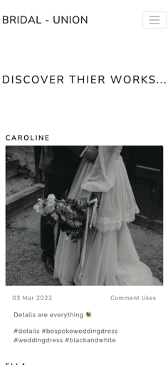
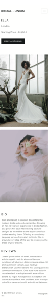

# BRIDAL-UNION

The live site can be found <a href="https://bridal-union.herokuapp.com/" target="_blank">here</a>

This is a full-stack framework project built using Django, Python, HTML, CSS, BootStrap and JavaScript. This is a social media inspired application designed to connect freelance wedding dress designers with future brides-to-be. The user can explore a range of designers, like and comment on images posted by a designer, as well as create, edit and delete bookings with their designer of choice. 

This project has been built on GitHub workspaces and deployed on Heroku. This project was built for educational purposes. 

## UX

Birdal-Union (BU) was built with two main intentions; to promote and to connect. With this in mind and following UX core principles, the UX had to be easy to navigate, intentional and pleasurable for the user, all whist encouraging user action. 

The first steps for structuring the UX were to outline the user’s needs collectively. For BU there are two main users; the designer (admin user) and the bride-to-be (end user). Both of which can full-fill each other’s needs; the bride needs a dress and the designer needs business, therefore the focus is to get both users to connect. To target this, the UX is based on social media platforms (such as Instagram) where the end user can connect with the designer through familiar features such as ‘follow’, ‘like’ and ‘comment’. 

When thinking of the user needs separately: for a future bride, wedding dress hunting can often be time-consuming and overwhelming, therefore the UX intends to take that away by offering something that is clean, focused as well as intuitive. We can also assume that this user will most likely be using their mobile phones more frequently than desktops screens (especially as a busy bride planning her wedding, most of the time looking for dresses are done on the commute to work). Therefore, responsivity and navigation are integral to the design and flow of the site. I have used the Bootstrap grid system, a selection of <a href="https://getbootstrap.com/" target="_blank">Bootstrap elements</a>, <a href="https://bootswatch.com/lux/" target="_blank">Bootswatch Lux</a> theme elements and custom CSS to allow for this. 

For the designer, promoting their work can also be challenging and time-consuming, to target this, the UX intends to promote their work in an elegant, interactive and efficient way. With this in mind, the focal point throughout the site are the images posted by the designers, therefore the UX was designed to act as a canvas to host these images in a responsive and eye catching way. To allow for this, I have used a Bootswatch Lux theme as the main theme for the site, <a href="https://getbootstrap.com/docs/4.0/examples/album/" target="_blank">Bootstrap album </a> elements as well as custom CSS.

------

## USERS

As outlined previously, there are two main users for Bridal-Union are:

**User 1** - A freelance wedding dress designer who is looking to promote their work, get client bookings and sell their services whilst expanding their clientele. 

**User 2** - A future bride-to-be who is looking for a wedding dress designer to make their dream dress for their big day. 

**User stories:**

Below are user story scenarios and how Bridal-Union intends to meet those needs.

**As a wedding dress designer (admin user):**

- I can easily post any images of my work via the admin panel so that I can share and promote my work  to a wider audience.

- I can log in to the admin panel so that I can access the site’s backend.

- I can easily log out of the admin panel as needed.

- Using the admin panel I can add important information to my profile such as location, starting price and biography so the user can easily view this information. 

- I can update my profile information via the admin panel to ensure my profile is always up-to-date.

- I can use the admin panel to delete images I no longer wish to have displayed on site. 

- When uploading my images, I can add a description to provide context for the user via the admin panel. 

- I don’t have to worry about resizing any images prior to upload as the admin panel takes care of that for me.

- I can add hashtags to my images to help target my intended audience and help follow trends.

- In the admin panel, I can reply back to comments left on my posts so I can interact and engage with the end user. 

- I can delete customer reviews if they are deemed bad via the admin panel. 

- I can confirm / decline customer booking if needed via the admin panel and the user will be notified of any changes.

**As a bride-to-be (end user):**

- I easily can browse through the app to get inspiration for my wedding dress by viewing posts/images from different designers. 

- I can view all images posted by a single designer by visiting their portfolio page. 

- Using the navigation bar and links throughout the site, I can navigate easily throughout the different pages to view the desired content.

- I can view a designer’s profile to find out more information about their services and work by visiting their profile page.  

- I can easily interact with the designer by liking and commenting on their posts.

- I can connect with the designer by following them via the follow feature so I can keep up to date with them.

- I can easily book an appointment with my designer of choice using the booking form. 

- I can easily create a customer account where I can manage and view my existing bookings. 

- I can log into my account to cancel and/or reschedule a booking if needed.

- If the designer has cancelled or rescheduled my booking, I will be notified.

- I can log into my account to update and edit my account information so that it is always up to date.

- I can easily log in and log out of my account as needed.

- I have the options to delete my account if I no longer need it.

------

## SCOPE

In order to achieve the desired user’s needs and business goals, the following features have been considered. However, kindly note that the full scope has not been met due to time constraints, please visit ‘Features left to implement’ below to see the features which have not been included in this current version of Bridal Studios. 

- Responsive navigation that will link to various pages throughout the site, collapse when viewed on specific screen sizes to allow for seam free navigation across all screen sizes.

- Landing page with hero image, tag line, short introduction and links to intuitively take the user to different parts of the website. 

- Discover Designers page where the user can scroll through the page to view, ‘follow’, ‘like’ and ‘comment’ on images posted by different designers. 

- Designer profile page where the user can read more information about a designer such as number of followers, biography, location and starting price.

- Portfolio page where the user can view all of the images posted by one designer in a single location. 

- Booking page where the user can make an appointment with their designer of choice via the booking form 

- About page to provide further information to the end user about the website and how it can help them. 

- Sign up, Log in and Log out features using Django allauth 

- Customer Account page where logged in users can edit/delete existing bookings and manage their customer account details 

- Email notifications to inform the customer when their booking has been confirmed, canceled or rescheduled by the designers. 

- Javascript and CSS animation features to enhance the overall UX.

---

## STRUCTURE / BACK END 

**App structure:**

For this current release, Birdal-Union is made up of two main apps:

social_marketplace - main functionality 

Djngo alltuh - registration and account management

**Database:**

It was advised to use cloud based databases given Heroku’s ephemeral file system, so the below have been used for this project:

For data storage - <a href="https://www.heroku.com/postgres" target="_blank">Heroku’s add-on PostgreSQL</a>

For image storage - <a href="https://cloudinary.com/" target="_blank">Cloudinary</a>

**Django Models:**

To achieve the current functionality, the social_marketplace app requires 4 main custom models and the Django built in User model:

**Django User model:**

I used <a href="https://docs.djangoproject.com/en/4.0/ref/contrib/auth/" target="_blank">Django’s built in User model</a> as is to handle all the user information. 

**Designer model:**

Contains information about the designer such as name, location, starting price and biography. This information is needed to build out the designer profile page. Each designer uses Django’s pre assigned id’s and this is used to target the designer to render the relative designer information on the designer profile page. There is also a date joined field provided which is not currently displayed on site, its intention is more for potential future administrative use. 

**Imageposts model:**

This model contains image information, number of likes and handles image upload and resizing. For the front end, each image that is posted displays the name of designer, date posted, number of likes, image description and hashtags for the end user’s information. For backend admin users, this models enables the admin to handle the status of the post by selecting either ‘draft’ or ‘posted’. The admin can also add or delete as many images as they desire. 

This model has a Foreign Key relationship to the Designer model so that an image can be access by the designer it was posted by (as well as its image id (again, default by Django)).

**ImageComments model:**

This models is to display and handle comments left by the end user on posts. Comments are subject to approval by the admin user and can be rejected if deemed bad. This model has a Foreign key relationship with ImagePosts in the ‘post’ field to ensure all respective comments are deleted in the event of an image post being deleted.

**Booking model:**

This model displays and handles the booking information needed for the booking form. A booking can only between one end user and one designer at a time, as a result this model has a One to One relationship with the Django built in User model and a Foreign Key relationship with the Designer Model, as well as a unique booking ref. Bookings are also subject to approval by the admin user which they can manage on the back end.

## STRUCTURE / FRONT END 

I wanted to keep the design clean, minimal and modern to allow emphasis and focus on the imagery posted by the designers.  As mentioned previously, the main theme for this site is provided by <a href="https://bootswatch.com/lux/" target="_blank">Bootswatch Lux</a> theme which allows to do just that. 

**Fonts:**

Header tags: Nunito Sans provided by Bootswatch Lux theme 

Paragraph tags:  Raleway from Font Awesome

**Color:**

Again, minimalistic is the theme throughout in oder to give emphasis to the images. Therefore the colour scheme is kept neutral  Black, White and Grey.

**Responsiveness:**

To allow for seam free navigation between the pages and for the images to adjust proportionately on various mobile screens, I’ve used a mix of Bootstrap classes and image elements, Bootswatch buttons, cards and navigation bar to enable this.

I’ve also used custom CSS and media queries to change certain page layouts when viewed on smaller and larger devices - login/logout and create account all have the same css structure. 

**Visual effects:**

The previous plan when designing the front end was to include gentle animation and visual effects to compliment certain features as well as provide more visual pleasure for the user. However, due to time constraints, there is only one animation feature (hero image on the landing page) in this current version. 

**Wireframes:**

The wireframes were used as a guide for the UX and front-end design, as a result the website differs from the wireframes, however the flow and logic are representative in the live site. The design features in the wireframes were also done before finding Bootswatch Lux theme, therefore some features on the wireframes are not included in this version. 

You can view the wireframes <a href="https://www.figma.com/file/kvbIiuHdZFGnj4ih7hIqC6/Bridal-Union-Wireframes" target="_blank">here</a>

---

## CURRENT FEATURES:

**Home page:**

When the user opens the app, this is the first page they will see therefore I used a strong hero image to capture the attention of the viewer. A zoom effect has also been applied to the hero image to visually excite the user.
This page has been kept simple in terms of design as it’s more of an introductory page to the app, to help with this a short tag line has been used to tell the user what this app is intended for. 

The first main page where BU intends to take the user is the ‘discover designers’ page (more information below), to allow for this I have included a large call-to-action button (underneath the tag line) which links to the ‘discover designer’ page so the user can intuitively and quickly navigate to the next page. The button design is from Bootswatch Lux Theme.

**Discover Designers page:**

As mentioned above, this is one of the main pages of the app. This page is where the social media inspired elements comes to play where the user can scroll through to view posts by different designers (like they would if they were on Instagram). The image posts includes the name of the designer so they user can see who it was posted by. The user can also click on the designer’s name at the tope of image which will take the user to the ‘designer profile’ page where the user can see more images and information on the designer. Other features on the image posts also include date posted, hashtags, ‘comment’ and ‘like’. 

For the ‘comment’ and ‘like’ features, only logged in users are able to ‘like’ and leave a ‘comment’ on the posts. However please note that due to time constraints the ‘like’ and ‘comment’ features are not currently working in this version. 

**Designer Profile page:**

Together with the ‘discover designer’ page, this is another main page where the user can find out more information about the designer. This page displays the designer’s; biography so the user can find out about the designer’s background and way of working, the designer’s location and starting price so the user can see where the designer is based and if their prices are suitable for them, all of the designer’s posts are also displayed in this page so the user can view all their work in one place. 

All of the information mentioned is to help the user feel like they can make an informed decision as to booking this designer in. To encourage this action, the booking button has been placed at the top of the page making it convenient and easy for the user to click on. 

Another feature of the this page is the ‘Reviews’ section which is at the bottom of the page. This section is to also provide more helpful information to the user to help them decide whether they want to boom this designer in or not. Also, logged in users are able to leave a review. However due to time constraints, this feature has not been completed for this version so a placeholder section has been used in the meantime.  

**Booking page:**

This page is where the designer can make a booking with their designer of choice using a simple booking form. To make a booking a user will have to be logged in. The booking form will take in important information such as the users name, designer’s name, date of wedding, date and time picker as well as a message box. This form is kept simple so that the user can have a nice and easy experience

Please kindly note that due to time constraints the booking form is currently not connected to the backend so the user is not currently able to make any bookings. 

**Create Account page:**

A user can create an account easily and quickly if they haven’t already done so. A user will need to create an account if they wish to make bookings and access other features of the site. 

The functionality and validations of this template are from Django alltuh with applied custom CSS, Bootstrap and Bootswatch elements for styling.

**Log in and Log out page:**

To access all features such as making a booking, ‘like’ and ‘commenting’ in images and ‘following’ a designer, the user will have to be logged in. A logged in user can also sign out easily.

The functionality and validations of these pages are from Django alltuh with applied custom CSS, Bootstrap and Bootswatch elements for styling.

**Customer Account page:**

This page is where the user can manage all of their booking and account information. Here the user can view any existing bookings they have made. The bookings are currently displayed on card which are provided by Bootswatch Lux theme. The booking cards show the name of the designer, the time and date of their booking. The booking cards also show ‘cancel’ and ‘edit’ links to allow the user to manage their booking as needed. The user also has the option to update their account details, delete their account or log out from their account. 

Please note that due to time constraints, this page is currently static and is not yet connected to the back end to access functionality. 

**Navigation bar:**

The Navbar is provided Bootswatch Lux theme. Its design is minimal and modern and it provides smooth and easy navigation for the user from page to page and across various screen sizes. 

On desktop screen the nav bar displays across the width of the top of the screen and all of the links in the nav bar are displayed evenly across the screen allowing the user to see each link clearly. The name of the app ‘Bridal Union’ is also displayed clearly in the left side of the nav bar, which when clicked on can take the user back to the home page from whatever page they are on.

On small screen devices, the nav bar then collapses to hamburger icon. When clicked on, the nav links drop down on a white background and push’s the page’s content down allowing the user to clearly view the links that are listed. This allows for better UX experience and improves accessibility.

When the user is signed in, the ‘log out’ and ‘customer account’ links will be displayed in the nav bar. 
When the user is signed out, the ‘sign in’ and  ‘create account’ links will be displayed in the nav bar. This allows for more intuitive and easy navigation for the user. 

**Footer:**

The footer is kept simple and is located at the usual place (at the bottom of the pages) to allow easy navigation and accessibility for the user. At the moment, the footer only has one social media link that when clicked on, the link opens up in a new tab in the browser so that the user can easily jump between the social media tab and the web site app easily to improve their user experience. 

**Zoom out effect:**

The hero image on the landing page as custom CSS animation to enhance user experience.

**Buttons:**

All buttons are provided by Bootswatch lux theme. 

‘Discover Designers’ buttons - takes the user to the discover designer’s page

‘Book Appointment’ button - allows the user to book an appointment with the designer and redirects them to the booking page

**Image posts:**

These are images posted by the designer. I used <a href="https://getbootstrap.com/docs/4.0/examples/album/" target="_blank">Bootstrap's Album</a>  example as a template to hold the images, I then customised it to the better suite the aesthetic of the app.

## FEATURES LEFT TO IMPLEMENT:

Due to time constraints, the following features have not yet been implemented to this version of the app. 

**About page:**

The about page will provide more detail and information to the user about Bridal Union and how it can be used 

**Profile Handle:**

This would be added to the designer profile. All profile pages on Instagram have a handle which is used a short introductory tag and allows the user to have a quick understanding of what they are about. 

**Portfolio page:**
At the moment, the designer profile page displays all the post which have been posted by that one designer. The more images a designer posts, the less likely the user will take notice of the designer’s biography and other important information. With this in mind, I had an idea to have a new page called the ‘portfolio’ page where the users can view all of the work by one designer in a single place where the images are displayed in a professional way and in much larger scales, like they would in a physical portfolio. This would enhance the user’s experience and promote of the work of the designer better.

**Follow feature:**

This would be featured on the designer profile page. 

**Like and Comment:**

As explained previously, these features are displayed on the image posts but are not yet fully working. 

**Reviews:**

As explained previously, this feature is displayed at the bottom of the ‘designer profile’ page. 

**Booking Form:**

The form is currently static and not yet connected to the back end.

**Booking management on Customer Account page:**

The user is supposed to be able to create, edit and delete bookings as needed however the logic and functionality has not been implemented. 

**Notifications:**

I planned for modals to appear throughout the site to tell the user when an action has been completed or when an error has been made, however the functionality has not yet been impelemented. 

---

## TECHNOLOGIES USED:

Front end languages  - HTML, CSS, JavaScript

Back end languages - Python3

<a href="https://www.djangoproject.com/" target="_blank">Django</a> - the selected framework that has been used to build this project. 

<a href="https://django-allauth.readthedocs.io/en/latest/installation.html" target="_blank">Django allauth </a> - used for the user account managment and registration.

<a href="https://www.heroku.com/postgres" target="_blank">Heroku PostgreSQL</a> - used in deployment to store the data for the models.

<a href="https://cloudinary.com/" target="_blank">Cloudianry</a> - use to store all of the static files and images.

<a href="https://getbootstrap.com/" target="_blank">BootStrap</a> - used for creating responsive design.

<a href="https://bootswatch.com/lux/" target="_blank">Bootswatch Lux theme</a> - used for the main deign theme and UX.

<a href="https://fonts.google.com/" target="_blank">Google Fonts</a> - used to for Raleway font which is used for the paragraph tags throughout the site.

<a href="https://favicon.io/" target="_blank">Favicon.io</a> - used to create favicon's for Birdal-Union.

<a href="https://www.figma.com/?fuid=" target="_blank">Figma</a> - for wireframe building.

<a href="https://developer.chrome.com/docs/devtools/" target="_blank">Google Dev Tools</a> - used for fixing any CSS issues, finding bugs and testing responsiveness across the project.

<a href="https://github.com/" target="_blank">Git</a> - used for version control by utilising the Gitpod terminal to commit to Git and Push to GitHub.

<a href="https://git-scm.com/" target="_blank">Github</a> - used to store code for the project after being pushed.

<a href="https://www.gitpod.io/" target="_blank">Gitpod</a> - used as the development environment.

<a href="https://id.heroku.com/login" target="_blank">Heroku</a> - selected platform to deploy this project 

---

## TESTING

Due to time constraints, no tests have been carried out for this version of Bridal Union.

---

## FIXED BUGS

**Failed to load favicon in initial deployment:**

During the initial deployment stages on Heroku, the favicon failed to load. The below steps fixed the problem:

- I removed DISBALE_STATIC FILES from my config vars in Heroku. At the time of initial deployment, this was only a temporary variable as I did not have any static files at the time.

**Failed to load static files in deployment:**

The below changes fixed the above:

- File path was incorrect, I removed the forward slash '/' in file path:

**Error with migrations and database:**

Whilst updating my Designer model I kept getting the below ProgrammingError;

***‘column social_marketplace_designer.starting_price does not exist’***

The above meant that either my migrations need to be ran again or, the fixtures aren’t loaded yet. Despite running several migrations the bug continued to persist. As a result the easiest option was to reset both my local and deployment databases. At that point I only had mock data so I could afford for the databases to be reset without lossing any valid or important data. I took the below steps to fix this issue:

1. Reset local sqlite database by running this command: ***python3 manage.py flush***

(I had to make sure that I was connected to the sqlite db before running this, so in my setting.py file I had to comment out the Heroku Postgres DATABASE URL link.) 

2. Reset the Herok postgres database. To this I had to comment out the sqlite database in my settings.py file before running the steps below:

- I went to the Heroku app dashboard and clicked on 'Resources', then clicked on 'Heroku Postgres'

- After clicking on 'Heroku Postgres' it opens in a new tab, then I went to 'Settings'

- In 'Settings' I clciked on 'Reset Database', typed in app name when prompted and clciked 'Reset Database'

After resetting, I had to return to my workspace and run migrations in my termial to recreate the database:

1. First I signed into Heroku to make sure I was connected: ***heroku login -i ***

2. After logging in I ran the following command in my termial: ***heroku run python3 manage.py migrate***

3. Then I hade to create a new superuser: ***heroku run python3 manage.py createsuperuser***

4. Complete - both local and deploymennt db have been reset 

**Error with migrations:**

When working with my previous customer model I kept receiving the below error in the terminal when running my migrations:

***ValueError with migration: ValueError: Field 'id' expected a number but got 'username'***

Reserving my migrations fixed the above issue, I took the below steps to do this;

1. Reverse my migrations back to to 00001 by running this command in the terminal: ***python3 manage.py migrate social-marketplace 00001***

2. Then I manually delete migrations files in my migrations.py folder, I deleted until file 00001

3. Applied new migrations:
- ***python3 manage.py makemigrations***
- ***python3 manage.py migrate***

## EXISTING BUGS

- In Deployment, when viewing the 'Sign In' page on media screens below 500px, the 'sign in' button doesn't work 

- In Deployment, when viewing the 'Sign Up' page on media screens below 580px, the 'sign up' button doesn't work

---

## DEPLOYMENT:

The master branch of this repository has been used for the deployed version of this application.

**Github and Gitpod:**

To deploy my Django application, I had to use the <a href="https://github.com/Code-Institute-Org/gitpod-full-template" target="_blank">Code Institute Python Essentials Template</a> 

Steps I followed to use this template:

1. Click the Use This Template button.

2. Add a repository name and brief description.

3. Click the Create Repository from Template to create your repository.

4. To create a Gitpod workspace you then need to click Gitpod, this can take a few minutes.

5. When you want to work on the project it is best to open the workspace from Gitpod (rather than Github) as this will open your previous workspace rather than creating a new one. You should pin the workspace so that it isn't deleted.

6. Committing your work should be done often and should have clear/explanatory messages, use the following commands to make your commits:

- ***git add .***  - adds all modified files to a staging area
- ***git commit -m "*** - lets you add a message explaining your commit": commits all changes to a local repository.
- ***git push*** -  pushes all your committed changes to your Github repository.

**Forking the GitHub Repository:**

If you want to make changes to your repository without affecting it, you can make a copy of it by 'Forking' it. This ensures your original repository remains unchanged:

1. Find the relevant GitHub repository

2. In the top right corner of the page, click the Fork button (under your account)

Your repository has now been 'Forked' and you have a copy to work on

**Cloning the GitHub Repository:**

Cloning your repository will allow you to download a local version of the repository to be worked on. Cloning can also be a great way to backup your work.

1. Find the relevant GitHub repository

2. Press the arrow on the Code button

3. Copy the link that is shown in the drop-down

4. Now open Gitpod & select the directory location where you would like the clone created

5. In the terminal type 'git clone' & then paste the link you copied in GitHub

6. Press enter and your local clone will be created.

**Creating an Application with Heroku:**

I followed the below steps using the Code Institute tutorial:

The following command in the Gitpod CLI will create the relevant files needed for Heroku to install your project dependencies pip3 freeze --local > requirements.txt. Please note this file should be added to a .gitignore file to prevent the file from being committed. A Procfile is also required that specifies the commands that are executed by the app on startup.

1. Go to Heroku.com and log in; if you do not already have an account then you will need to create one.

2. Click the New dropdown and select Create New App

3. Enter a name for your new project, all Heroku apps need to have a unique name, you will be prompted if you need to change it.

4. Select the region you are working in.

Heroku Settings You will need to set your Environment Variables - this is a key step to ensuring your application is deployed properly:

- In the Settings tab, click on Reveal Config Vars and set the following variables:

 SECRET_KEY - to be set to your chosen key

 CLOUDINARY_URL - to be set to your Cloudinary API environment variable

In the resources tab you must install 'Heroku Postgres’

**Heroku Deployment In the Deploy tab:**

1. Connect your Heroku account to your Github Repository following these steps:

 - Click on the Deploy tab and choose Github-Connect to Github.
 - Enter the GitHub repository name and click on Search.
 - Choose the correct repository for your application and click on Connect.

2. You can then choose to deploy the project manually or automatically, automatic deployment will generate a new application every time you push a change to Github, whereas manual deployment requires you to push the Deploy Branch button whenever you want a change made.

3. Once you have chosen your deployment method and have clicked Deploy Branch your application will be built and you should see the below View button, click this to open your application.

---

## CREDITS:

Throughout the process of building this application, I used various online resources to help me with a range of different things from fixing bugs, understand Django functionality and design features. They are as follows:

Code Institute - for zoom animation on hero image 

<a href="https://bootswatch.com/lux/" target="_blank">Bootswatch Lux</a> - for main design theme and UX

<a href="https://getbootstrap.com/docs/4.0/examples/album/" target="_blank">Bootstrap Album template </a> - for discover designers gallery

<a href="https://django-allauth.readthedocs.io/en/latest/installation.html" target="_blank">Django allauth </a> - for account managment and registration.

<a href="https://ccbv.co.uk/" target="_blank">ccvv.co.uk</a> - for information on clased based view

<a href="https://simpleisbetterthancomplex.com/2015/12/04/package-of-the-week-django-widget-tweaks.html" target="_blank">Simple is better than Complex, Django Widget Tweaks</a> - for information on django tweaks to edit forms.

<a href="https://simpleisbetterthancomplex.com/tutorial/2016/07/22/how-to-extend-django-user-model.html" target="_blank">Simple is better than Complex, How to Extend Django User Model</a> - for further information on the Django User model and how to extend it.

Dennis Ivy, <a href="https://www.youtube.com/watch?v=llbtoQTt4qw" target="_blank">Django To Do List App With User Registration & Login</a> - youtube video to show CRUD functionailty.

Dennis Ivy, <a href="https://www.youtube.com/watch?v=VOddmV4Xl1g" target="_blank"> Model Form | Django</a> - youtube video to further show model form fucntionality

Chuck Severance,<a href="https://www.youtube.com/watch?v=AQFC13D2mRM&t=4s" target="_blank">URL Routing in Django </a> - youtube video for understand URL routing in Django

Lara code, <a href="https://www.youtube.com/watch?v=Ij1MCRk-d6c&list=PL9tgJISrBWc5619CclyqYrnnMkVOPzVYM" target="_blank">Django Instagram Code</a> - youtube video to show how to create an Instagram clone app in Django

---

## ACKNOWLEDGEMENTS:

I’d like to give a massive thanks to my previous course mentor Felipe Souza Alacron for the guidance, support and feedback throughout the beginning of this project up until the middle of this project when he resigned from mentoring at the Code Institute. 

I’d like to thank my new and current course mentor Jack for the support, guidance and feedback throughout the last part of this project, as well as sharing useful online resources. 

I’d like to thank the Code Institute tutors who helped me fixed the bugs mentioned above.

I’d like to thank my fellow peers Harry Dhillon, Daisy Gunn and Francesa for their support and feedback. 

---

## REFLECTIONS:

---

---

